# <Projectname> NMA documentation

## Groupmembers
### Group 14
1. Berth Layton
2. Dewulf Kemp

## Project summary
Sky Eye is a flight tracking application designed to provide users with real-time
information about flights and airport activities. The users will be able to see an overview
of all current flights presented on a world map + a list with all big airports and aircraft types. What sets Sky Eye apart is its innovative
Augmented Reality (AR) feature that allows users to identify airplanes in the air with their
camera.

## Requirements
### ℹ️ Legend
- :heavy_check_mark: = Implemented
- :x: = Not implemented
- :hourglass: = Work in progress

|Status|Description|Details|
|---|---|---|
||**Must have (12/20)**||
|:heavy_check_mark:| Build a multiscreen app (at least 4 screens) using the Jetpack Navigation component | [Go to screenshots](#screenshots)
|:heavy_check_mark:| Use Jetpack Compose with Kotlin to build your screen layout (use at least 4 different elements with mandatory: a scrollable List, Button, Text and Image) | [Go to screenshots](#screenshots)
|:heavy_check_mark:| Create a menu-based navigation and bottom navigation | [Go to screenshots](#screenshots)
|:heavy_check_mark:| Use the Android app architecture (ViewModel – State in Compose)
|:heavy_check_mark:| Use a local Room database to store user data persistently | [Go to Room database](#room-database)
|:heavy_check_mark:| Use Retrofit to communicate with an API service | [Go to API request](#api-request)
|:heavy_check_mark:| Schedule at least 1 background task using the Workmanager | [Go to workmanager](#workmanager)
|:heavy_check_mark:| Use at least 2 Implicit Intents | [Go to intents](#intents)
|:heavy_check_mark:| Write significant tests to make a robust app (code coverage at least 90%) | [Go to screenshots](#screenshots)
|:heavy_check_mark:| Implement a custom application theme using MaterialDesign with a custom app icon | [Go to screenshots](#screenshots)
|:heavy_check_mark:| Generate an installable APK
||
|| **Intermediate - self learning topics (14+/20)**
|:heavy_check_mark:| Notifications | [Go to notifications](#notifications)
|:heavy_check_mark:| Canvas and animations | [Go to canvas & animations](#canvas-and-animations)
|:x:| Sensor data (GPS, motion, position, environmental)
|||
||**Experienced - self learning topics (16+/20)**
|:heavy_check_mark:| Use the CameraX library | [Go to camera](#camera)
|:x:| Use the ML Kit to add new experience features to your app (Vision and/or Natural Language API)

## Overview app
### Screenshots
Give screenshots for every screen in the application.

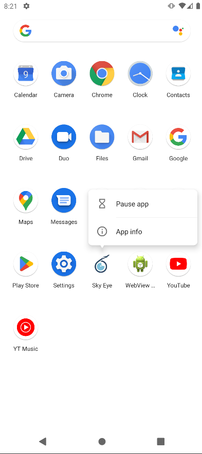
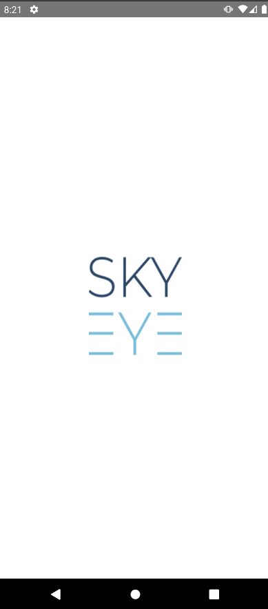
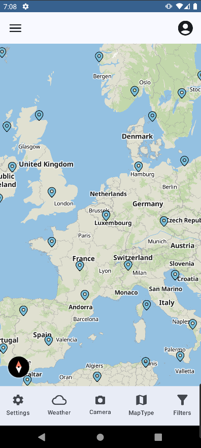
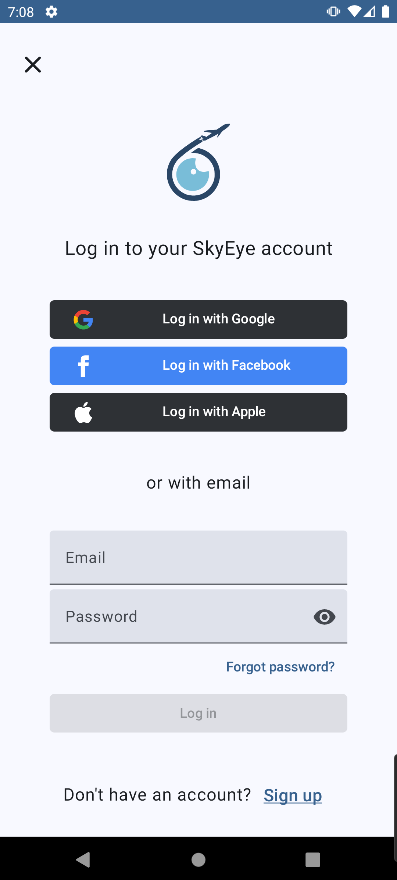
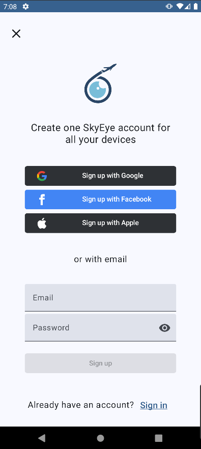
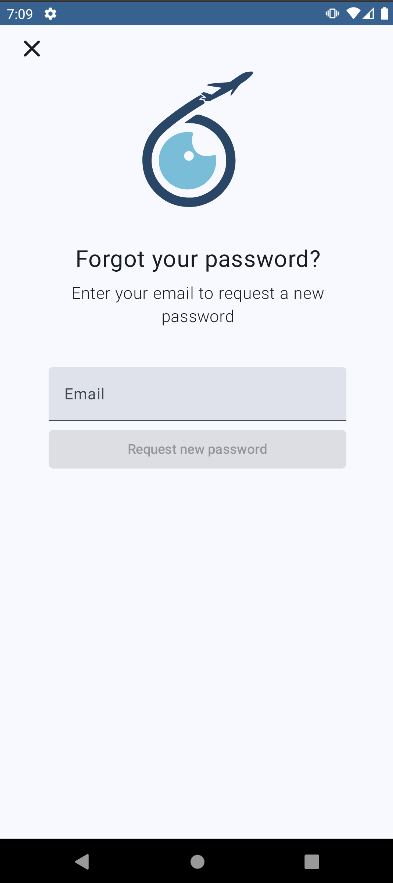
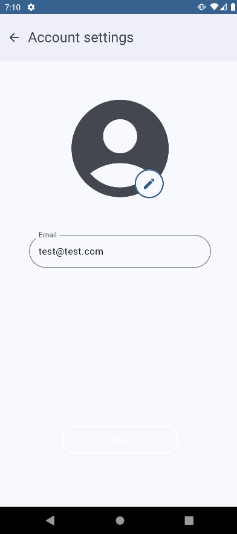

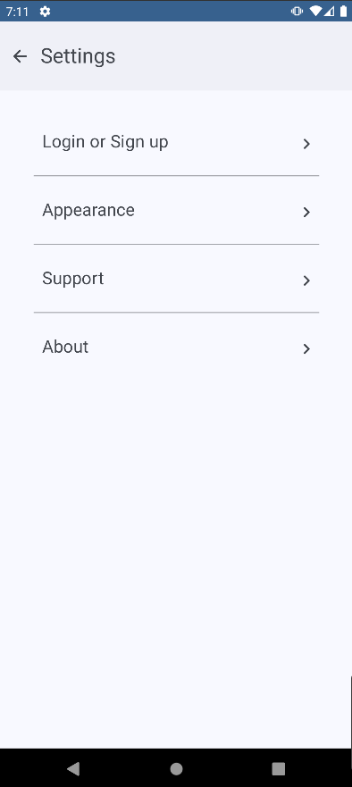
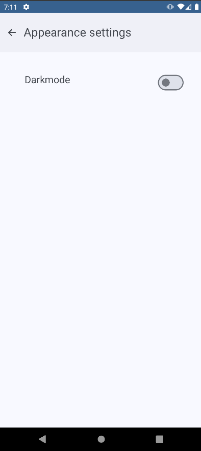
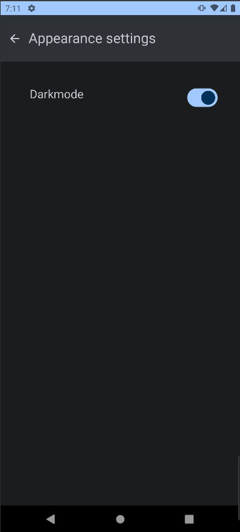

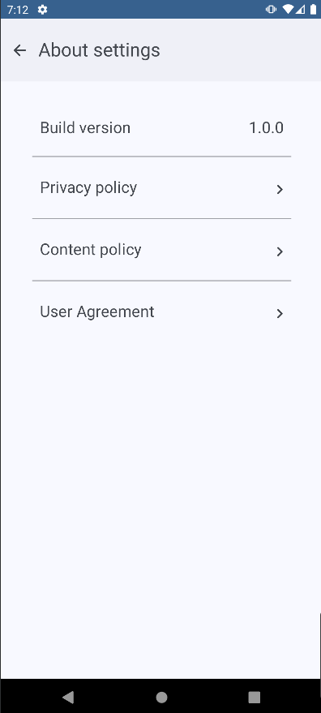
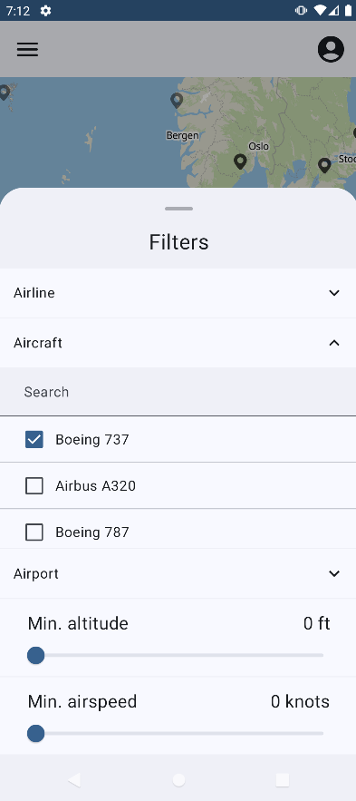
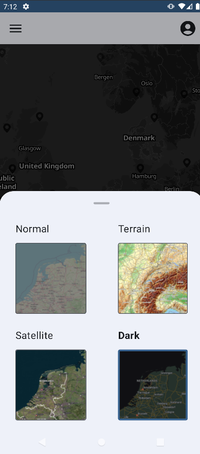
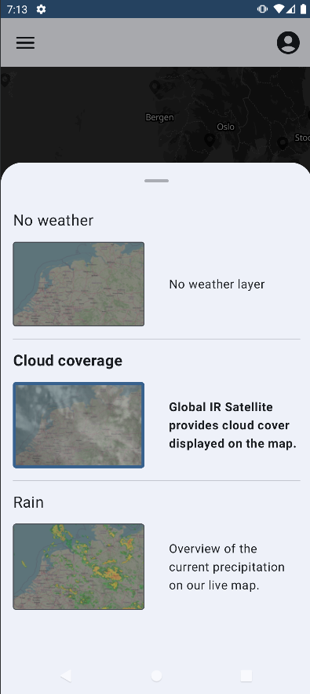
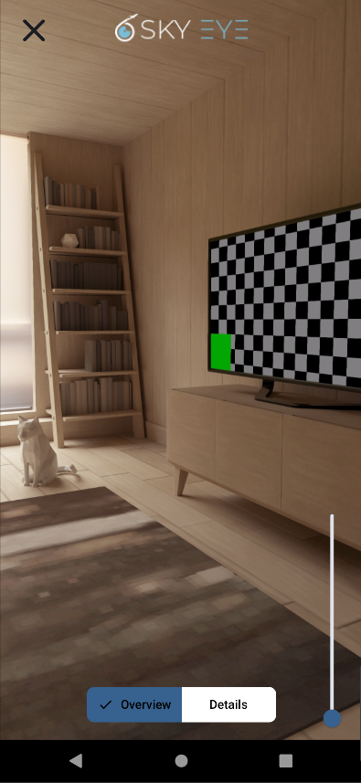
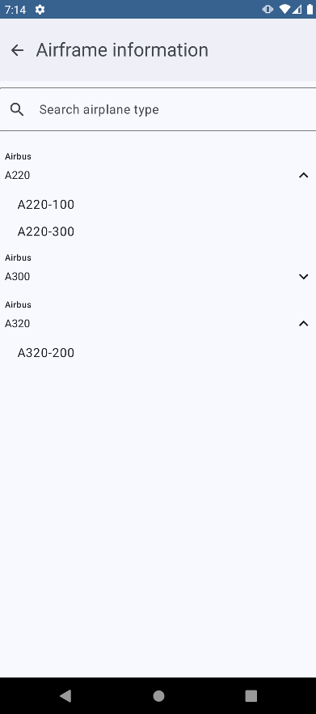

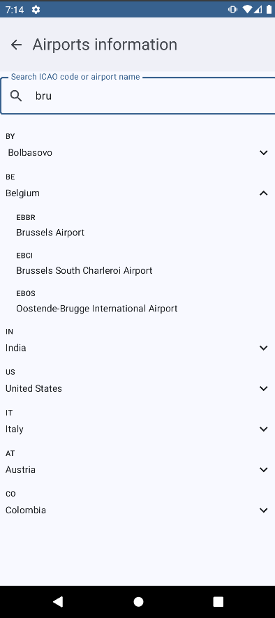
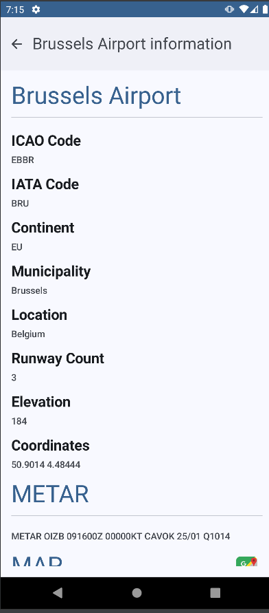

### Room database
We have a database that currently stores 2 things:
- User login information:\

- Appearance settings:\

### API request
We use an API to retrieve airport details: \

### Intents
1. Support email: On the support page, clicking the email address opens the email app.\
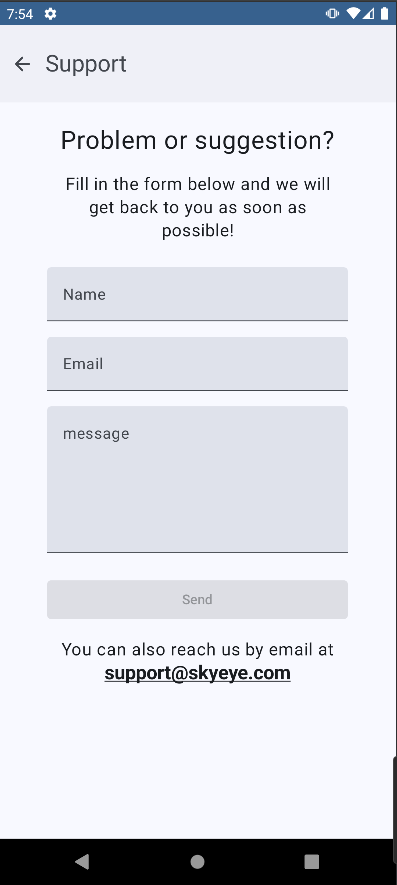
2. Maps: On an airport page users can click a button to show the airport on their map app.\
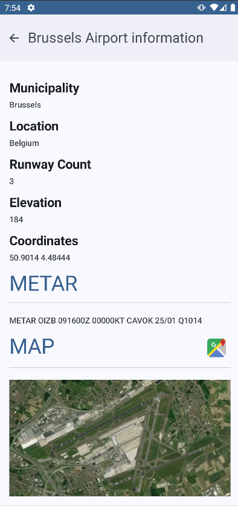

### Workmanager
If the app has not been opened for 2 days, the workmanager will send a push notification to increase user engagement.
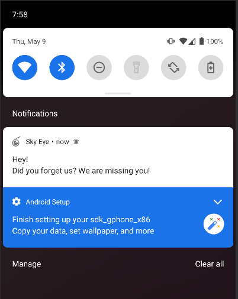

### Notifications
If the app has not been opened for 2 days, the workmanager will send a push notification to increase user engagement.\

### Canvas and animations
Canvas is used to show airport markers on the map.\
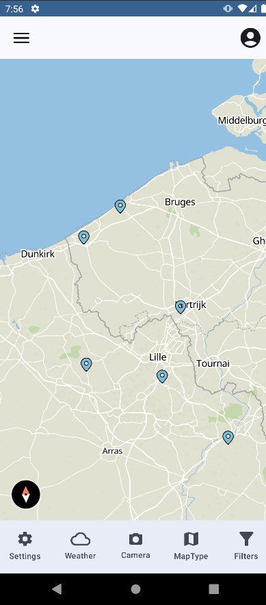

### Sensor data
Optional: not implemented.

### Camera
When a user wants to know what an airplane in the sky is, they can use the built-in camera AR feature.\

### ML kit
Optional: not implemented.

## Repositories
- Code
  - https://gitlab.ti.howest.be/ti/2023-2024/s4/native-mobile-apps/projects/group-14/01-code
- APK
  - https://gitlab.ti.howest.be/ti/2023-2024/s4/native-mobile-apps/projects/group-14/02-apk

## Link movie
- Demo App: https://www.youtube.com/watch?v=zPMMDet_dAg
- Code explanation: https://www.youtube.com/watch?v=qNs32lNKpZw

## Link to Google profile accounts
- Layton Berth - https://developers.google.com/profile/u/layton-berth
- Kemp Dewulf - https://developers.google.com/profile/u/kempdewulfhowest
